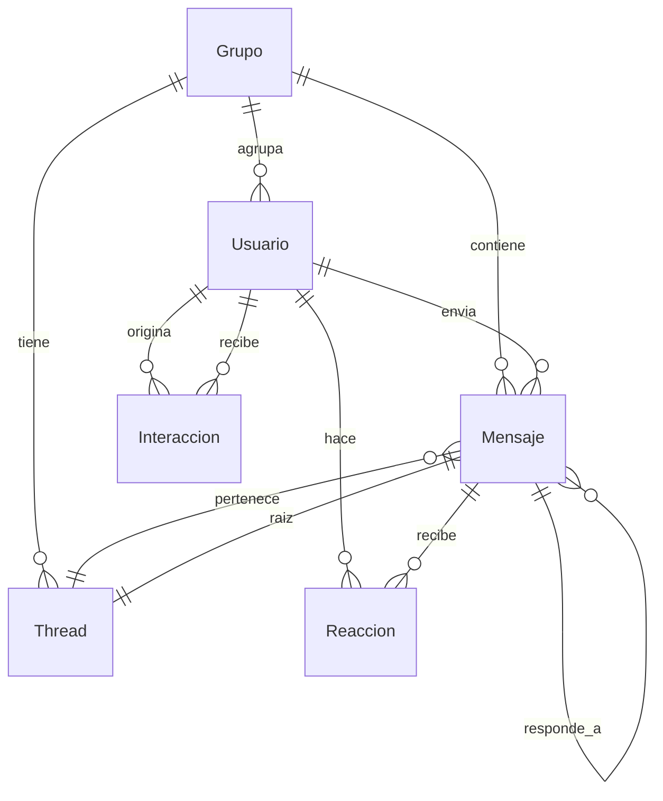

# Diagrama Entidad-Relación — Modelo de Datos

## Contexto

Modelo abstracto diseñado para representar cualquier plataforma de chat (WhatsApp, Telegram, Discord, Slack, Teams).
Sirve como esquema objetivo contra el cual mapear exports reales.

---

## Diagrama (Mermaid)

---

## Entidades y Atributos

### Grupo
| Columna | Tipo | Constraint | Descripción |
|---------|------|------------|-------------|
| id_grupo | VARCHAR(64) | PK | Identificador único del grupo |
| nombre | VARCHAR(255) | NOT NULL | Nombre visible del grupo |
| plataforma | ENUM | NOT NULL | `whatsapp` / `telegram` / `discord` / `slack` / `teams` |
| fecha_creacion | DATETIME | NULLABLE | Fecha de creación del grupo (si está disponible) |
| metadata | JSON | NULLABLE | Metadata adicional específica de plataforma |

### Usuario
| Columna | Tipo | Constraint | Descripción |
|---------|------|------------|-------------|
| id_usuario | VARCHAR(64) | PK | ID único del usuario en el sistema (puede ser el ID de plataforma o uno generado) |
| nombre | VARCHAR(255) | NOT NULL | Nombre mostrado en el chat |
| id_grupo | VARCHAR(64) | FK → Grupo | Grupo al que pertenece. Misma persona en distintos grupos = distinto registro |
| plataforma | ENUM | NOT NULL | Plataforma de origen |
| fecha_ingreso | DATETIME | NULLABLE | Fecha del primer mensaje conocido (proxy de ingreso) |
| fecha_ultima_actividad | DATETIME | NULLABLE | Fecha del último mensaje o reacción conocido |
| es_bot | BOOLEAN | DEFAULT FALSE | Indica si es un bot y no un humano |
| perfil_asignado | ENUM | NULLABLE | `nucleo` / `buscador_validacion` / `integrado_silencioso` / `periferico` / `fantasma` / `no_clasificado`. Se asigna en pipeline. |
| metadata | JSON | NULLABLE | Datos extra (teléfono en WhatsApp, user_id en Discord, etc.) |

### Mensaje
| Columna | Tipo | Constraint | Descripción |
|---------|------|------------|-------------|
| id_mensaje | VARCHAR(128) | PK | ID único del mensaje (de plataforma o generado) |
| id_usuario | VARCHAR(64) | FK → Usuario, NOT NULL | Autor del mensaje |
| id_grupo | VARCHAR(64) | FK → Grupo, NOT NULL | Grupo al que pertenece |
| timestamp | DATETIME | NOT NULL | Fecha y hora de envío (ISO 8601) |
| texto | TEXT | NULLABLE | Contenido del mensaje. NULL si es solo multimedia |
| id_thread | VARCHAR(128) | FK → Thread, NULLABLE | Hilo al que pertenece (si aplica) |
| id_mensaje_respuesta | VARCHAR(128) | FK → Mensaje (self-ref), NULLABLE | Mensaje al que responde directamente (reply) |
| deleted_flag | BOOLEAN | DEFAULT FALSE | Indica si el mensaje fue borrado posteriormente |
| multimedia_flag | BOOLEAN | DEFAULT FALSE | Indica si contiene archivos multimedia (foto, video, audio) |
| tipo_contenido | ENUM | NULLABLE | `texto` / `imagen` / `video` / `audio` / `documento` / `sticker` / `sistema` |
| metadata | JSON | NULLABLE | Metadata extra (duración de audio, dimensiones de imagen, etc.) |

### Reaccion
| Columna | Tipo | Constraint | Descripción |
|---------|------|------------|-------------|
| id_reaccion | BIGINT | PK, AUTO_INCREMENT | ID único de la reacción |
| id_mensaje | VARCHAR(128) | FK → Mensaje, NOT NULL | Mensaje que recibe la reacción |
| id_usuario | VARCHAR(64) | FK → Usuario, NOT NULL | Usuario que reacciona |
| tipo_emoji | VARCHAR(64) | NOT NULL | Emoji usado (ej: "👍", "❤️", "😂" o ID de emoji personalizado) |
| timestamp | DATETIME | NOT NULL | Cuándo se hizo la reacción |

### Thread
| Columna | Tipo | Constraint | Descripción |
|---------|------|------------|-------------|
| id_thread | VARCHAR(128) | PK | ID único del hilo |
| id_grupo | VARCHAR(64) | FK → Grupo, NOT NULL | Grupo al que pertenece |
| id_mensaje_raiz | VARCHAR(128) | FK → Mensaje, NOT NULL, UNIQUE | Mensaje que inició el hilo |
| timestamp_inicio | DATETIME | NOT NULL | Fecha del primer mensaje del hilo |
| timestamp_fin | DATETIME | NULLABLE | Fecha del último mensaje del hilo |
| num_mensajes | INT | NULLABLE | Cantidad de mensajes en el hilo (calculado) |
| num_participantes | INT | NULLABLE | Cantidad de usuarios distintos en el hilo (calculado) |

### Interaccion
| Columna | Tipo | Constraint | Descripción |
|---------|------|------------|-------------|
| id_interaccion | BIGINT | PK, AUTO_INCREMENT | ID único |
| id_usuario_origen | VARCHAR(64) | FK → Usuario, NOT NULL | Quién inicia la interacción |
| id_usuario_destino | VARCHAR(64) | FK → Usuario, NOT NULL | Quién recibe la interacción |
| id_mensaje | VARCHAR(128) | FK → Mensaje, NULLABLE | Mensaje asociado (si existe) |
| tipo | ENUM | NOT NULL | `respuesta_directa` / `mention` / `reply_thread` / `reaccion` |
| timestamp | DATETIME | NOT NULL | Cuándo ocurrió |
| peso | FLOAT | DEFAULT 1.0 | Peso de la interacción (1.0 estándar, puede ajustarse) |

> **Nota:** `Interaccion` es una tabla **derivable** (se construye a partir de `Mensaje` y `Reaccion`). Se materializa como tabla para agilizar consultas de sociograma y evitar recalcular repetidamente.

---

## Cardinalidades

| Relación | Desde | Hasta | Tipo |
|----------|-------|-------|------|
| Grupo → Mensaje | 1 | N | Un grupo contiene muchos mensajes |
| Grupo → Usuario | 1 | N | Un grupo agrupa muchos usuarios |
| Grupo → Thread | 1 | N | Un grupo tiene muchos hilos |
| Usuario → Mensaje | 1 | N | Un usuario envía muchos mensajes |
| Usuario → Reaccion | 1 | N | Un usuario hace muchas reacciones |
| Usuario → Interaccion (origen) | 1 | N | Un usuario inicia muchas interacciones |
| Usuario → Interaccion (destino) | 1 | N | Un usuario recibe muchas interacciones |
| Mensaje → Reaccion | 1 | N | Un mensaje recibe muchas reacciones |
| Mensaje → Mensaje (self) | 0..1 | N | Un mensaje puede tener muchas respuestas directas |
| Mensaje → Thread | N | 1 | Muchos mensajes pertenecen a un hilo (o ninguno) |
| Thread → Mensaje (raíz) | 1 | 1 | Un hilo tiene exactamente un mensaje raíz |

---

## Reglas de Negocio

1. **Unicidad de usuario por grupo:** Un mismo usuario real en distintos grupos se registra como registos separados en `Usuario` (misma persona, contextos distintos).
2. **Mensajes sin texto:** Si un mensaje es solo multimedia, `texto = NULL` y `multimedia_flag = TRUE`.
3. **Reacciones duplicadas:** No se permite la misma combinación (id_mensaje, id_usuario, tipo_emoji) duplicada. Cada usuario solo puede reaccionar una vez con el mismo emoji a un mensaje.
4. **Thread opcional:** No todas las plataformas tienen threads. `id_thread` es NULL cuando la plataforma no soporta hilos o el mensaje está fuera de uno.
5. **Interaccion como tabla materializada:** Se regenera periódicamente desde las fuentes. No es de ingesta directa.

---

## Ejemplo de Población

### Grupo
| id_grupo | nombre | plataforma | fecha_creacion |
|----------|--------|------------|----------------|
| G001 | Amigos del Barrio | whatsapp | 2025-01-15T10:00:00Z |

### Usuarios
| id_usuario | nombre | id_grupo | plataforma |
|------------|--------|----------|------------|
| U001 | Ana | G001 | whatsapp |
| U002 | Luis | G001 | whatsapp |
| U003 | Carla | G001 | whatsapp |

### Mensajes
| id_mensaje | id_usuario | id_grupo | timestamp | texto | id_mensaje_respuesta |
|------------|------------|----------|-----------|-------|----------------------|
| M001 | U001 | G001 | 2025-01-15T10:05:00Z | ¿Quedamos este finde? | NULL |
| M002 | U002 | G001 | 2025-01-15T10:06:00Z | Yo sí | M001 |
| M003 | U003 | G001 | 2025-01-15T10:07:00Z | 👍 | M001 |

### Reacciones
| id_reaccion | id_mensaje | id_usuario | tipo_emoji | timestamp |
|-------------|------------|------------|------------|-----------|
| 1 | M001 | U002 | 👍 | 2025-01-15T10:05:30Z |
| 2 | M001 | U003 | ❤️ | 2025-01-15T10:05:45Z |

### Interacciones (derivadas)
| id_interaccion | id_usuario_origen | id_usuario_destino | id_mensaje | tipo | timestamp | peso |
|----------------|-------------------|--------------------|------------|------|-----------|------|
| 1 | U002 | U001 | M002 | respuesta_directa | 2025-01-15T10:06:00Z | 1.0 |
| 2 | U003 | U001 | M003 | respuesta_directa | 2025-01-15T10:07:00Z | 1.0 |
| 3 | U002 | U001 | 1 | reaccion | 2025-01-15T10:05:30Z | 0.5 |
| 4 | U003 | U001 | 2 | reaccion | 2025-01-15T10:05:45Z | 0.5 |
